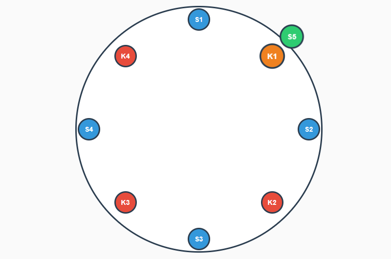

# 5장 안정 해시 설계

### 안정 해시가 무엇인가?

해시 테이블의 크기가 변할 때, 평균적으로 K/N의 키만 재배치하면 되는 해시 기법입니다.
(K = 키의 개수, N = 슬롯 또는 서버의 개수) 
  
원활한 이해를 위해 아래 이미지에 그려진 해시 링(해시값을 원형으로 연결한 가상의 고리)을 보면 키 4개, 서버 4개가 할당되어 있는 것을 알 수 있습니다.

### 기본 동작 원리

각 키는 해시 링에서 시계 방향으로 탐색하여 만나는 첫 번째 서버에 할당됩니다.
• K1 → S2 서버    • K2 → S3 서버    • K3 → S4 서버    • K4 → S1 서버

### 만약 여기에 서버(S5)가 새로 추가된다면?

새로운 서버 S5가 추가되면서 K1만 S2에서 S5로 이동하게 됩니다.
**전체 4개 키 중 1개만 재배치!**
(이론적으로 K/N = 4/5 ≈ 0.8개, 실제로는 1개 이동)

### 그렇다면 만약 서버가 제거된다면 어떻게 될까?

S2 서버가 제거되면 K1만 다음 서버인 S3로 재배치됩니다.
마찬가지로 4개 키 중 1개만 재배치!
(K/N = 4/3 ≈ 1.33개, 실제로는 1개 이동)

### 안정 해시 설계를 해야 하는 이유?

**전통적인 해시 방식의 문제점:**
> 단순하게 `serverIndex = hash(key) % N` 으로 계산할 경우, 서버가 추가/제거되면 N값이 변경되어 대부분의 키가 다른 서버로 재할당됩니다.
> 이는 대규모 캐시 미스를 유발하여 시스템 성능에 심각한 영향을 줍니다.

**안정 해시의 장점:**
- 서버 추가/제거 시 평균적으로 K/N 개의 키만 재배치
- 대부분의 키는 기존 위치 유지 → 캐시 히트율 유지
- 수평적 확장(horizontal scaling)에 유리

### 기본 안정 해시 구현의 문제점

**1. 파티션 크기의 불균형**
- 서버가 추가/제거될 때 특정 서버가 과도하게 넓은 영역을 담당할 수 있습니다.
- 예: S2가 삭제되면 S1의 담당 영역이 다른 서버에 비해 2배 이상 커집니다.
- 이는 특정 서버에 부하가 집중되는 문제를 발생시킵니다.

**2. 키의 불균등 분포**
- 해시 링에서 서버들이 균등하게 배치되지 않으면 키도 불균등하게 분포됩니다.
- 특정 구간에 키가 몰릴 수 있어 일부 서버는 과부하, 일부는 유휴 상태가 될 수 있습니다.

### 문제를 어떻게 해결할까?

**가상 노드 (Virtual Nodes) 기법**

하나의 물리적 서버를 해시 링 위의 여러 지점에 복제하여 배치하는 기법입니다.

**동작 원리:**
- 각 서버를 여러 개의 가상 노드로 표현 (예: S1-1, S1-2, S1-3, ...)
- 각 가상 노드는 서로 다른 해시값을 가져 링의 다른 위치에.
- 키는 여전히 시계 방향으로 만나는 첫 번째 가상 노드(실제로는 해당 물리 서버)에 할당.

**장점:**
- 가상 노드의 개수가 많을수록 키의 분포가 더 균등해집니다.
- 표준편차가 감소하여 각 서버의 부하가 고르게 분산됩니다.
- 서버 추가/제거 시에도 부하 재분배가 더 균등하게 이루어집니다.

**트레이드오프:**
- 가상 노드가 많을수록 → 더 균등한 분포, 하지만 메타데이터 관리 비용 증가
