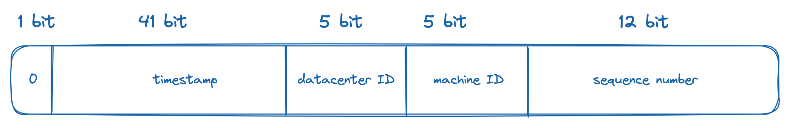

## 설계 요구사항

- ID는 유일하며 정렬 가능할 것
- ID는 숫자로만 구성될 것
- ID는 64bit로 표현 가능할 것
- ID는 발급 날짜 순으로 정렬될 것
- 초당 10,000개 ID 생성이 가능할 것

## 구현 방식들 비교

### 다중 마스터 복제 (multi-master replication)

- DB의 `auto_increment`를 활용하는 방식
- 다만 일반적으로 사용되는 1만큼 증가 방식이 아닌, k만큼 증가 방식 (k = DB 서버 수)
- 단점
  - 여러 데이터 센터에 걸쳐서 규모를 확장하기에는 어려움
  - 시간 순서 보장을 할 수 없음
  - 서버 추가 및 삭제에 대한 대응이 어려움

### UUID (Universally Unique Identifier)

- 충돌 가능성이 지극히 낮은 128bit 수 활용
- 서버 간 조율이 필요 없으며, 각자 독립적으로 ID 생성기를 사용하면 됨
- 장점
  - 구현이 단순
  - 서버 간 조율이 필요 없으니 동기화 이슈도 없음
- 단점
  - 128bit는 길다
  - 시간 순 정렬 불가능
  - 숫자가 아닌 값을 포함해야 함

### 티켓 서버

- `auto_increment` 기능을 갖춘 티켓 서버 형태의 DB를 중앙 집중형으로 사용하는 방식
- 장점
  - 구현이 단순
  - 중소 규모 애플리케이션에 적합
- 단점
  - 티켓 서버가 SPOF(Single-Point-of-Failure)가 되어버림
  - 티켓 서버를 다중화할 수도 있겠지만 그럴 경우 동기화 이슈가 붙어버림

### ⭐️ 트위터 snowflake

- sign bit: 음수와 양수 구분
- timestamp: epoch 이후 몇 ms 경과했는지 표시
  - ID가 시간순으로 정렬되게 함
  - 41bit로 대략 69년 간의 날짜 표현 가능
  - 69년이 지나면 epoch 기준값을 바꾸거나, ID 체계를 마이그레이션해야 함
- data center: 32개의 데이터 센터 지원 가능
- machine: 데이터 센터 당 32개 서버 사용 가능
- sequence number: 각 서버에서 생성하는 ID의 일련번호
  - 생성할 때마다 1씩 증가
  - 1ms 경과할 때마다 0으로 초기화됨
  - 1ms 당 4,096개 ID 생성 가능

## 추가 논의사항들

- 시계 동기화 (clock synchronization)
  - ID를 생성하는 서버마다 다른 시계를 사용할 경우 어떻게 할 것인가?
  - 여러 서버가 물리적으로 독립된 여러 장비에서 실행되는 경우에는 어떻게 할 것인가?
  - NTP(Network Time Protocol) 참고할 것
- section 길이 최적화
  - 동시성 이슈가 적다면 sequence number 섹션을 줄이고 timestamp 섹션을 늘려도 좋을 것
- 고가용성
  - ID 생성기는 mission critical 하므로, 아주 높은 가용성을 제공해야 함
