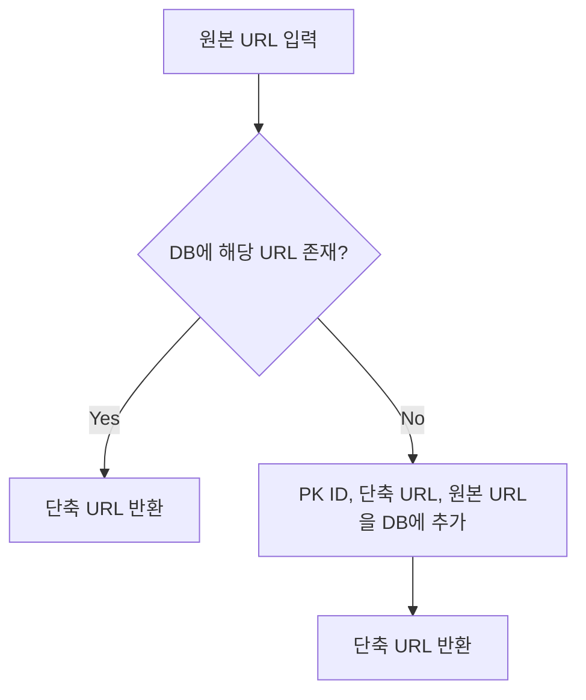
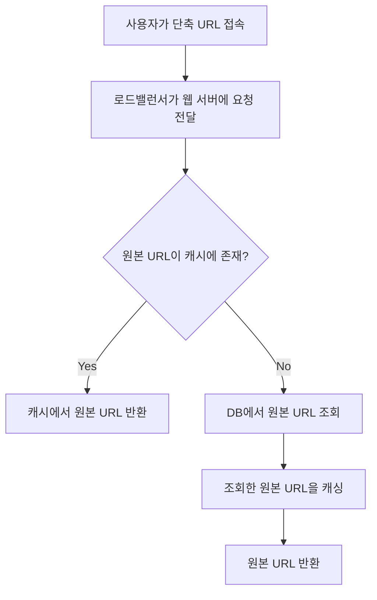

## 설계 요구사항

- 매일 1억 개 단축 URL을 만들 수 있을 것
- 초당 쓰기 연산 1,160개
- 초당 읽기 연산 11,600개
- 축약 전 URL 평균 길이 = 100
- 10년 간 운영하며 3,650억 개 레코드를 보관해야 함 (36.5TB 저장 공간 필요)

## 설계 및 구현

### API 엔드포인트

- RESTful 설계 필요
- 2개 엔드포인트 필요
  - URL 단축용 엔드포인트
  - URL 리디렉션용 엔드포인트

### URL 리디렉션

- 301 응답과 함께 Location 헤더에 원래 URL을 넣어서 반환해야 함
- 301 Permanently Moved
  - 영구적으로 이전되었다는 뜻
  - 브라우저는 응답을 캐시 → 서버 부하를 줄여줄 수 있음
- 302 Found
  - 일시적으로 이전되었다는 뜻
  - 요청은 캐시 없이 언제나 단축 URL 서버를 거친 후 원래 URL로 리디렉션
  - 클릭 발생률, 발생 위치 추적 등에 대한 트래픽 분석이 필요한 경우 활용

### 데이터 모델

- 메모리 방식은 공간이 한정적이고 비쌈
- RDBMS 활용이 적합

### 해시 함수

- 해시 값의 길이
  - 해시 값은 `[0-9, a-z, A-Z]` 총 62개 값에 대한 조합
  - `62ⁿ ≥ 3,650억` 조건을 달성해야 함
  - `n = 7`일 때 3.5조 개 URL 생성 가능
  - 따라서 길이 7의 문자열로 처리 가능
- 해시 함수 구현 기술
  - 해시 후 충돌 해소 기법
    - CRC32, MD5, SHA-1 등의 해시 함수를 사용해도 7글자로 줄일 수는 없음
    - 해시 값 첫 7글자만 활용할 수도 있을 것
    - 충돌할 경우 해소될 때까지 임의 문자열 붙이기
    - 중복 여부를 DB에 질의해야 하므로 오버헤드가 큰 방식
    - bloom filter를 사용하면 성능을 끌어올릴 수는 있음
  - base-62 변환
    - base conversion은 URL 단축기에 흔히 사용됨
    - 62진법인 이유는 사용할 character 종류가 62개이므로

## 플로우차트

### URL 단축기 플로우차트

### URL 리디렉션 플로우차트

## 추가 논의사항들

- 웹 서버의 규모 확장
  - stateless 기반이므로 자유롭게 확장 가능
- 데이터베이스의 규모 확장
  - 다중화 및 샤딩을 적용하면 규모 확장성 달성 가능
- 데이터 분석 솔루션
  - 어떤 링크가 많이 클릭되었는지, 언제 주로 클릭했는지를 분석할 수도 있을 것
