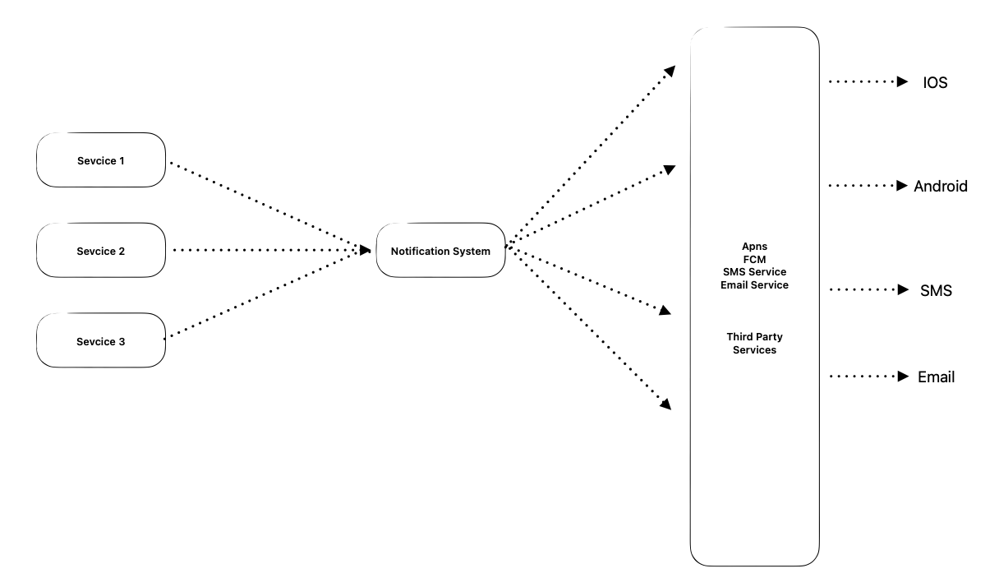

## 알림 시스템

- 1~N 까지의 서비스 : 알림을 보내고자 하는 서비스 컴포넌트
알림 시스템 : 제3자 서비스에 맞는 알림 페이로드를 만들어 제3자 서비스에게 요청하는 컴포넌트
- 서비스가 요청을 보낼 수 있는 API를 제공
- 제3자 서비스 (Third Party Services) : 실제로 유저에게 알림을 보내는 컴포넌트
iOS, 안드로이드, SMS, 이메일 단말
초안의 문제점

> 알림 시스템 서버 하나가 장애나면, SPOF(Single Point Of Failure) 전체 서비스의 장애로 이어진다.

### 규모 확장성
한 대의 서비스로 푸시 알림에 관계된 모든 것을 처리하고 있으므로, 규모 확장성이 있지는 않음.
- 트래픽이 늘어나면 성능 병목이 생김

- 규모 확장성 & SPOF 해결
데이터베이스와 캐시를 알림 시스템의 주 서버에서 분리
- 제3자 서비스 하나가 장애나도, 전체 장애로 이어지지는 않는다.
- 제3자 서비스별로 메시지 큐를 이용해 시스템 컴포넌트 사이의 강한 결합을 끊는다.

## 상세 설계
### 데이터 손실 방지
- 어떤 상황에서도 알림이 소실되면 안 된다 (알림이 지연되거나 순서가 보장이 안되도 됨)

- 알림 데이터를 DB에 보관하고, 재시도 메커니즘 구현
- 알림 로그 DB 유지
- 알림 중복 전송 방지

    보내야 할 알림이 도착하면, 그 이벤트 ID를 검사하여 이전에 본적이 있는 이벤트인지 살핀다.
본적이 있는 이벤트면 버리고, 아니면 알림을 발송한다.

- 알림 템플릿
사전에 지정한 형식에 맞춰 알림을 만들어 내는 틀 템플릿을 사용하면 알림의 형식을 일관성있게 유지가능

### 알림 설정
사용자가 알림을 받을지 말지에 대한 설정을 상세히 조정할 수 있어야 한다.

**전송률 제한-**
사용자에게 너무 많은 알림을 보내지 않도록 알림의 빈도를 제한한다.

**재시도 방법-**
제3자 서비스가 알림 전송에 실패하면 해당 알림을 재시도 전용 큐에 넣는다.

**푸시 알림과 보안**
iOS와 안드로이드 앱의 경우, 알림 전송 API는 시크릿 키를 사용하여 보안을 유지한다. 인증된 클라이언트만 해당 API를 사용하여 알림을 보낼 수 있다.

**큐 모니터링**
큐에서 메시지가 잘 빠져나가는지 모니터링하고 대응할 수 있어야 한다.

**이벤트 추적**
알림 확인율, 클릭율, 실제 앱 사용으로 이루어지는 비율과 같은 메트릭을 만들기 위해 이벤트를 추적하고 분석 서비스와도 통합할 수 있어야 한다.