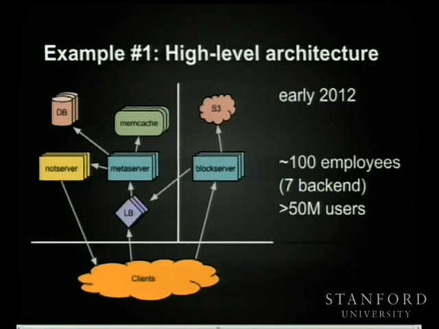

## 살펴볼 서비스들

- Google Drive
- Dropbox
- Naver MYBOX

## Google Drive - Differential Synchronization

[Neil Fraser - Differential Synchronization](https://neil.fraser.name/writing/sync/)

### 1. Conventional Strategies

동기화에 사용되는 가장 일반적인 3가지 접근법들은 저마다의 단점이 존재함

- **Locking**
  - 한 번에 한 사용자만 편집 가능
  - 다른 모든 사용자는 읽기 권한만 가짐
- **Event passing**
  - 모든 사용자의 모든 동작을 포착해서 다른 사용자들에게 전달하는 방식
  - Operation Transformation 기반 알고리즘이 사용되고 있음
  - 하나라도 놓치면 fork가 발생해서 버전 간격이 커질 수 있음
- **Three-way merge**
  - 작동 방식
    - 클라이언트가 수정된 문서 내용을 서버로 전송
    - 서버는 3-way merge를 통해 변경 사항을 추출하고 다른 사용자의 변경사항들과 병합
    - 서버는 문서의 새로운 사본을 클라이언트로 전송
  - 반이중 통신 방식이기에 동기화 중엔 수정이 불가능하며, 지연 시간이 생겨 실시간성이 떨어짐

### 2. Differential Synchronization Overview

- 백그라운드에서 diff 및 patch 연산을 무한 사이클링하는 대칭 알고리즘 방식
- 3 way merge 방식의 "닭들이 멈춰야만 수를 셀 수 있다" 라는 제약 조건이 없어짐


동작 방식

1. Client Text는 매번 Common Shadow와 비교됨
2. `diff` 함수는 Client Text의 편집 내용들 반환
3. 비교 이후 Client Text는 Common Shadow로 복사되고, 멀티스레드 환경을 위해 텍스트 스냅샷 생성
4. 수정 사항은 best-effort와 함께 Server Text에 적용해야 함
5. `patch` 결과로 Server Text 업데이트, 4번과 5번 단계는 블로킹될 필요가 없음

`patch` 알고리즘은 **fuzzy** 방식이다

- 즉 문서가 동기화 중에 변경되었더라도 patch가 적용될 수 있음

### 3. Dual Shadow Method


- Client Text와 Server Shadow가 대칭적으로 일치하도록
- Server Text와 Client Shadow가 대칭적으로 일치하도록
- 텍스트에 대한 `patch`는 취약하더라도 best-effort를 유지하는 **fuzzy patch**로 수행
- 하지만 best-effort는 네트워크 환경에서 보장할 수 있는 것이 없으므로, Client Shadow에 대한 간단한 체크섬도 전송
  - 체크섬은 Server Shadow와 비교하며, 일치하지 않을 경우 전체 텍스트 본문 재전송

### 4. Guaranteed Delivery Method


- Server Shadow는 최신 사본을, Backup Shadow는 장애에 대응하기 위한 이전 버전을 보관
- 비대칭성으로 변화
  - 데이터 손실의 경우 서버와의 연결 구성이 중요하므로
  - 클라이언트 측 Backup Shadow를 만들 수도 있겠지만 실용적이지 않음

### 5. Topology


- 클라이언트를 여러 서버에 균등하게 분산하는 방식
- 균형 트리를 사용해 클라이언트 간 최단 경로 제공
- server-to-server 로도 토폴로지 방식으로 연결

## Dropbox - How We've Scaled Dropbox

[How We've Scaled Dropbox](https://youtu.be/PE4gwstWhmc?si=BtMRTVAcAS9W93cq)

### Background: what is Dropbox

- Goal: 사용자가 언제 어디서든 파일을 쉽게 가져올 수 있도록 하는 것
- 사용자의 디바이스에서 변경사항이 발생할 때마다 업로드
- Scale
  - 10s million 사용자가 이용중
  - 하루에 100s million 파일이 싱크됨
- Challenges
  - 쓰기 볼륨
    - 대부분의 시스템은 읽기 비율이 많지만 Dropbox는 그렇지 않음
      - 읽기:쓰기 비율이 대략 1:1
    - PB 단위의 캐시를 사용해야 함
  - ACID
    - 대용량 파일에 대한 온전한 동기화
    - 여러 디바이스에서 동시에 같은 Dropbox로 파일을 업데이트하는 경우를 위한 격리성
    - 오프라인 작업도 지원해야 함

### Examples: how have we evolved

**High-level 아키텍처**

- 초기에는 단일 서버로 시작
- MySQL 인스턴스와 S3 도입
- 서버를 알림 서버, 메타데이터 서버, 블록 서버로 분리
  - 블록 서버는 로드밸런서로 RPC 통신을 수행하고, 메타데이터 서버가 모든 것을 캡슐화
- Memcache를 추가해서 DB 부하 분산
- 파일은 4MB의 청크로 나눠서 S3에 저장하며, 해시값을 통해 올바른 객체로 판정



**server_file_journal**

- 클라이언트의 변경 사항을 메타데이터 서버에 업로드하고 서버가 로그에 기록하는 과정

```sql
CREATE TABLE `server_file_journal` (
  `id` int(10) unsinged,
  `filename` varchar(255),
  `latest` tinyint(1),
  `ns_id` int(10) unsigned,
  `prev_rev` int(10) unsigned,
  PRIMARY KEY (`ns_id`, `id`)
) ENGINE=InnoDB;
```

## Naver MYBOX - macOS 스마트 동기화

[Naver D2 - 스마트 동기화](https://d2.naver.com/helloworld/9386302)

### 동기화 방식 비교

**폴더 동기화**

- 사용자의 파일 및 폴더를 로컬에도 유지하고 클라우드에도 동기화하는 방식
- 디바이스 저장 공간을 차지한다는 단점

**네트워크 가상 디스크 마운트**

- 클라우드를 사용자 디바이스의 특정 위치에서 연결하는 방식
- 오프라인 상태에서 접근할 수 없다는 단점

**스마트 동기화**

- 위 두 방식을 적절히 섞은 방식
- 사용자의 로컬에 메타데이터 유지
- 사용자가 파일을 열려고 하는 시점에 메타데이터를 토대로 파일 다운로드
- 사용자가 원하는 시점에 파일들을 다시 메타데이터 상태로 원복 가능

### File Provider

- 원격 저장소 데이터를 동기화할 수 있는 Apple의 프레임워크
- APFS(AppleFileSystem)에 클라우드를 결합해서 사용자의 파일/폴더를 on-demand로 다운로드할 수 있게 해줌

**dataless / materialized**

- 파일
  - dataless: 메타데이터만 있음
  - materialized: 메타데이터 및 콘텐츠 데이터 모두 존재
- 폴더
  - dataless: 시스템이 폴더의 존재는 알지만 폴더의 콘텐츠를 나열하지 않은 상태
  - materialized: 시스템이 폴더의 콘텐츠를 나열한 상태
- 사용자가 dataless 파일/폴더를 열 때 콘텐츠를 다운로드하고 materialized 상태로 변경

**domain**

- 사용자가 클라우드에서 접근할 수 있는 파일 트리 하나를 domain 이라고 부름
- 도메인은 여러 개 생성 가능하며, 각 도메인마다 루트 폴더 생성

### 폴더 나열

- 루트 폴더 접근 시 스토리지 내 모든 항목 나열
- enumeration 과정이라고도 불림

### 파일 다운로드

- 사용자가 파일을 열려고 할 때 다운로드 발생
- dataless 상태의 파일을 materialized 상태로 전환

### 로컬 변경 사항 반영

- 사용자가 파일을 변경할 경우 변경을 감지하고 서버로 전송
- 생성된 파일의 초기 상태는 materialized

### 원격 변경 사항 반영

- 사용자가 다른 클라이언트에서 파일을 변경한 경우 변경사항 조정
- 푸시 알림을 기반으로 비동기적 수행
- 파일의 초기 상태는 dataless

### 축출

- materialized 상태의 파일을 다시 dataless 상태로 변경
- 사용자가 원하는 시점 혹은 저장 공간이 부족해진 경우 발생
